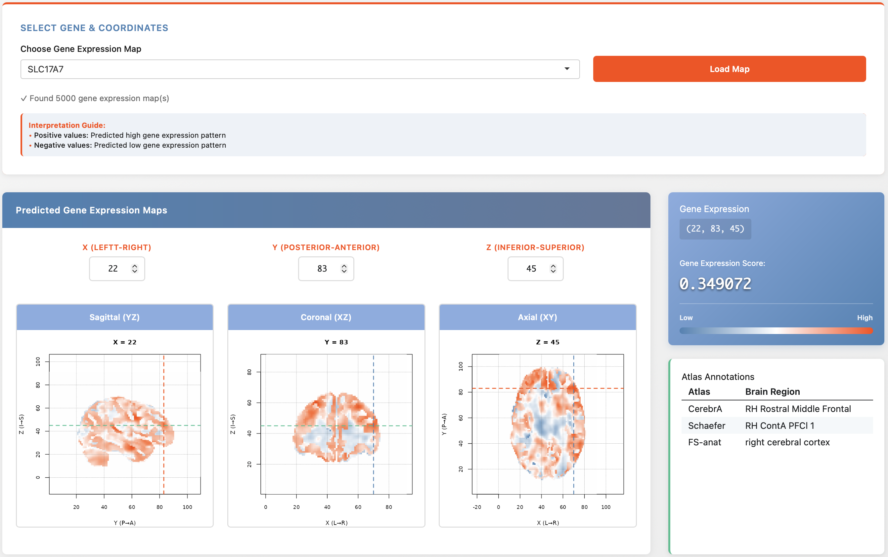
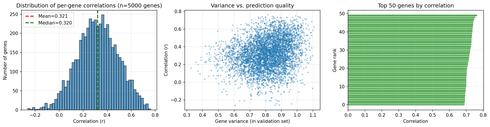

# Brain Gene Expression Mapping with Implicit Neural Representations

This repository contains code to process Allen Human Brain Atlas (AHBA) microarray gene expression data, train a deep implicit neural representation (INR) model to predict full‑brain 3D expression maps, and visualize the results through an interactive Shiny application.

  
*Interactive viewer for predicted gene expression maps (sagittal, coronal, axial slices).*

## Overview

The project aims to create high‑resolution spatial maps of gene expression across the entire brain using limited, sparsely sampled microarray data. The approach:

1. **Preprocesses AHBA data** – correct for donor effects, filter for gray matter, retain genes with high inter‑donor consistency, apply ComBat batch correction, and normalize.
2. **Trains a hierarchical INR** – three structure‑specific (cortex, cerebellum, brainstem) SIREN encoders and decoders learn to predict expression from normalized MNI coordinates + structure label.
3. **Generates whole‑brain volumes** – predict expression at every voxel of a 2mm MNI grid, producing NIfTI files for each gene.
4. **Visualizes interactively** – a Shiny app lets users explore any gene’s predicted 3D map, view orthogonal slices, and read atlas‑based region labels.

## Repository Structure

| File | Description |
|------|-------------|
| `01_data-prep.R` | Raw data download, QC, gene filtering, ComBat correction, normalisation |
| `config.py` | Configuration class (paths, hyperparameters, MNI bounds) |
| `dataset.py` | PyTorch Dataset for AHBA samples, with optional variance‑based gene selection |
| `model.py` | `HierarchicalGeneINR`: three structure‑specific SIREN encoders + gene decoders |
| `train.py` | Training loop with mixed precision, smoothness regularisation, checkpointing |
| `inference.py` | Generate full‑brain 2mm / 8mm NIfTI volumes for all genes |
| `analyze_results.py` | Validation set correlation analysis, per‑gene plots |
| `analyze_results_gene-select.py` | Same, but aligns number of genes with the checkpoint (used for top‑5000 model) |
| `check_training.py` | Quick training curve visualisation from saved checkpoints |
| `04_nifti-to-shiny.R` | Shiny app code (UI and server) for interactive 3D slice viewing |
| `gene_analysis_spatial_top5k.png` | Example figure: correlation distribution, variance vs. correlation, top genes |

## Data Preprocessing (R)

- Raw data from 6 donors (`MicroarrayExpression.csv`, `SampleAnnot.csv`, `Probes.csv`) are merged.
- Gray matter only (excluding corpus callosum, cingulum, central glial substance, choroid plexus, pineal gland).
- Genes are filtered to **protein‑coding** and those with **inter‑donor correlation > 0.4** (Markello et al. 2021).
- Low‑variance genes (variance < 0.05) are removed.
- **ComBat** is applied to remove donor batch effects.
- Expression values are **z‑scored per structure** (cortex, cerebellum, brainstem) and clipped to [-3, 3].

## Model Architecture (PyTorch)

The model is a **hierarchical Implicit Neural Representation** that treats each brain structure separately:

- **Input**: (x, y, z) normalized to [-1, 1] + structure index (0=CTX, 1=CRB, 2=SCTX)
- **Spatial encoders**: three independent SIREN networks (12 layers, 512 hidden units) that map coordinates to a 256‑dim latent code.
- **Gene decoders**: three independent MLPs that map the latent code to expression values for all genes.
- **Output**: selected via structure index → final expression vector.

This design allows each structure to learn its own spatial frequency patterns while sharing no weights.

## Training

- **Loss**: MSE + λ·smoothness (penalising large expression changes over small spatial displacements).
- **Optimizer**: AdamW with separate learning rates (encoders: 1e‑4, decoders: 3e‑4).
- **Mixed precision** (`GradScaler`) for speed.
- **Validation**: leave‑one‑donor‑out (donor H0351.1016 held out) or spatial group 5‑fold.
- **Checkpoints** saved every 5 epochs and best model by validation correlation.

Training on the top 5000 most variable genes yields:

    Correlation distribution:
      Mean: 0.3264
      Median: 0.3302
      Genes with r>0.5: 703 (14.1%)
      Genes with r>0.3: 2874 (57.5%)

## Inference

`inference.py` generates whole‑brain predictions:

1. Creates a regular grid at 2mm (and optionally 8mm) resolution covering MNI space.
2. Assigns each voxel a structure label using an FSL‑like atlas.
3. Runs the model in batches, producing a `(N_voxels, N_genes)` array.
4. Saves:
   - Compressed numpy array (`.npz`)
   - Gene‑wise metadata CSV
   - Top 100 most variable genes as NIfTI files (for easy viewing)

Output is organised under `predictions/2mm/` and `predictions/8mm/`.

## Results Analysis

`analyze_results_gene-select.py` loads the best model and validation set, computes per‑gene Pearson correlations, and produces:

- Histogram of correlations
- Scatter plot of gene variance vs. correlation
- Bar plot of top 50 genes
- Printed lists of top/bottom 20 genes

## Interactive Shiny App

The R script `04_nifti-to-shiny.R` launches a browser‑based viewer:

- Select a gene (NIfTI file) from the dropdown.
- View sagittal, coronal, and axial slices simultaneously.
- Click on any slice to move the crosshair; coordinates update in real time.
- Read the exact predicted expression value at the cursor.
- Consult a table with region labels from **CerebrA**, **Schaefer**, and **FS‑anat** atlases.

